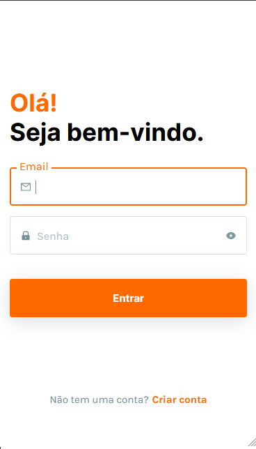
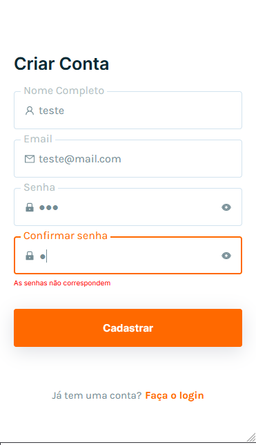
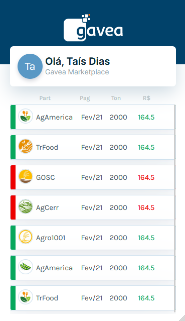

# Aplicação Front End - Gavea

A aplicação foi criada utilizando React.js

## O que foi utilizado?

- Para estilização foi utilizado apenas styled-components.
- Como biblioteca de estado foi utilizado context api.
- Foi utilizado typescript com react.
- Na tela Home foi adicionado algumas animações.
- No total foram feitos 5 teste, em duas telas diferentes.
- Como simulação de banco de dados foi utilizado a seguinte api publica de dados mocados: [TypiCode](https://my-json-server.typicode.com/taisspadotin/DataBase/db), que aceita requisições com base em um arquivo json criado pelo github.

## Utilizando o sistema

O sistema pode ser utilizado da seguinte forma:
A tela home é protegida por autentição, então para acessa-la é necessário se cadastrar, após se cadastrar o usuário é redirecionado para a tela de login, onde a mesma pode utilizar o email e senha que foram cadastrados, ou utilizar algum email disponível na api utilizada, como a api utilizada não possui persistencia de dados, os usuarios cadastrados só tem validade até o reload da pagína ser feito(pois foram feito utilizando context api).

Uma vez que o usuário loga no sistema ele passa a ter acesso a tela de home.

Se o usuário tentar acessar a tela de home sem estar devidamente logado, ele é redirecionado para a tela inicial.

Uma vez logado o usuário só perderá o acesso a tela home, caso limpe os dados do navegador(como não há nenhuma api para verificar o se o token é valido, ele apenas valida se o usuário possui um token).

Uma vez logado ao clicar em entrar na tela inicial o usuário será redirecionado para a tela Home.

- A aplicação é responsiva, é considerado com dispositivos móveis telas de até 800px, e a partir disso ela é apresentada de forma responsiva para web(foram realizadas algumas alterações do design para a versão web, para a melhor experiencia do usuário, como a definição de uma tamanho menor para os botões e inputs, mas a versão mobile segue 100% o protótipo).

- Foram criados testes para duas telas do sistema, sendo esses a tela de Login e a tela de SingUp, nesses ele fazem algumas validações de comportamentos esperados, para utilizar os testes basta utilizar o comando `npm test`.

- Algumas ferramentas foram transformadas em componentes para otimizar o uso, como os campos de Input, os botões e os componentes de lista, estes estão dentro da pasta Components e seu uso é feito de forma genérica.
<br />


## Resultado

### Tela Welcome


<br />

### Tela Login


<br />

### Tela SingUp


<br />

### Tela Home


<br />

## Rodando o sistema
Para utilizar o sistema basta na pasta do projeto rodar no terminal:
```
npm install
npm start
```